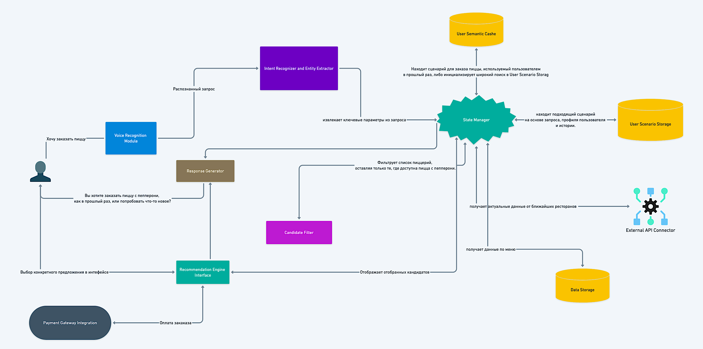

 # Описание компонентов системы AI-ассистента

## 1. **Voice Recognition Module**

- **Функция**: Преобразует голосовые команды пользователя в текст.
- **Взаимодействие**:
    - **Принимает**: Голосовые команды от пользователя.
    - **Отправляет**: Текстовую транскрипцию в **Intent Recognizer and Entity Extractor** для дальнейшего анализа.

## 2. **Intent Recognizer and Entity Extractor**

- **Функция**: Анализирует текст на предмет намерений пользователя и извлекает ключевые данные и параметры запроса.
- **Взаимодействие**:
    - **Принимает**: Текст от **Voice Recognition Module**.
    - **Отправляет**: Распознанные намерения и параметры в **State Manager** для определения следующих шагов.

## 3. **State Manager**

- **Функция**: Осуществляет центральное управление потоком данных и координацию сценариев взаимодействия, обеспечивая адаптацию ответов системы к текущим запросам пользователя и контексту.
- **Взаимодействие**:
    - **Принимает**: Информацию о намерениях и параметрах от **Intent Recognizer and Entity Extractor**, кешированные сценарии от **Semantic Cache** и детализированные сценарии от **User Scenario Storage** для комплексного анализа и выбора оптимального сценария ответа.
    - **Отправляет**: Команды и запросы к **External API Connector** для сбора внешней информации, запросы к **Data Storage** для доступа к сохраненным данным, данные в **Response Generator** для создания пользовательских ответов, и параметры в **Recommendation Engine Interface** для генерации персонализированных рекомендаций. Управляет процессом фильтрации через **Candidate Filter**, подготавливая итоговый список вариантов для пользователя.

## 4. **Semantic Cache**

- **Функция**: Обеспечивает быстрый доступ к повторяющимся или часто используемым сценариям и данным для ускорения обработки запросов.
- **Взаимодействие**:
    - **Принимает**: Запросы на данные от **State Manager**.
    - **Отправляет**: Кешированные данные обратно в **State Manager** для быстрой реакции на запросы пользователя.

## 5. **User Scenario Storage**

- **Функция**: Хранит детальную историю взаимодействий пользователя с системой, что позволяет адаптировать ответы и рекомендации к индивидуальным предпочтениям пользователя.
- **Взаимодействие**:
    - **Принимает**: Запросы на доступ к историческим данным от **State Manager**.
    - **Отправляет**: Соответствующие данные обратно в **State Manager** для помощи в формировании ответов.

## 6. **Response Generator**

- **Функция**: Создает окончательные ответы для пользователя, сформулированные на основе собранных данных и анализа.
- **Взаимодействие**:
    - **Принимает**: Инструкции и данные от **State Manager**.
    - **Отправляет**: Сформулированный ответ пользователю через голосовой или текстовый интерфейс.

## 7. **Candidate Filter**

- **Функция**: Отфильтровывает и сортирует возможные варианты выбора на основе заданных критериев, обеспечивая наиболее релевантные и целесообразные опции для пользователя.
- **Взаимодействие**:
    - **Принимает**: Параметры и данные от **State Manager**.
    - **Отправляет**: Отфильтрованный список вариантов обратно в **State Manager**.

## 8. **External API Connector**

- **Функция**: Интегрирует внешние данные, доступные через API, такие как информация о ресторанах, погоде, трафике, для обогащения ответов системы.
- **Взаимодействие**:
    - **Принимает**: Запросы от **State Manager**.
    - **Отправляет**: Собранные данные обратно в **State Manager**.

## 9. **Data Storage**

- **Функция**: Служит центральным хранилищем данных системы, включая информацию, полученную от внешних источников, и данные, сгенерированные внутренними процессами.
- **Взаимодействие**:
    - **Принимает**: Запросы от  **State Manager**.
    - **Отправляет**: Хранит данные и предоставляет их по запросу от **State Manager**.

## 10. **Recommendation Engine Interface**

- **Функция**: Анализирует поведение пользователя и предпочтения для генерации персонализированных рекомендаций и предложений.
- **Взаимодействие**:
    - **Принимает**: Параметры и контекст от **State Manager**.
    - **Отправляет**: Рекомендации обратно в **State Manager** для интеграции в пользовательский ответ.

## 11. **Payment Gateway Integration**

- **Функция**: Обеспечивает обработку платежей, связанных с заказами и покупками, совершенными через систему.
- **Взаимодействие**:
    - **Принимает**: Запросы на проведение транзакций от **Recommendation Engine Interface**.
    - **Отправляет**: Подтверждение об успешной или неуспешной оплате обратно в **Recommendation Engine Interface**.
